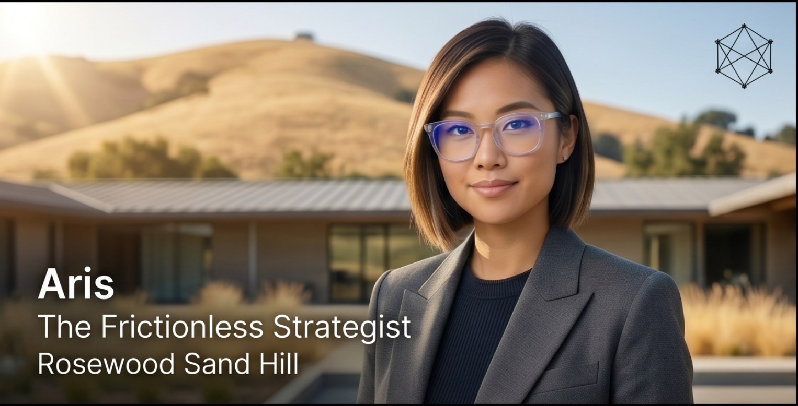
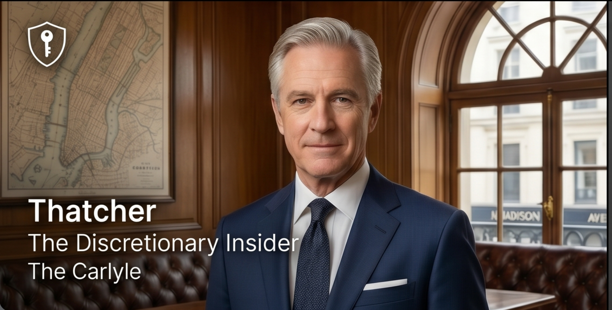
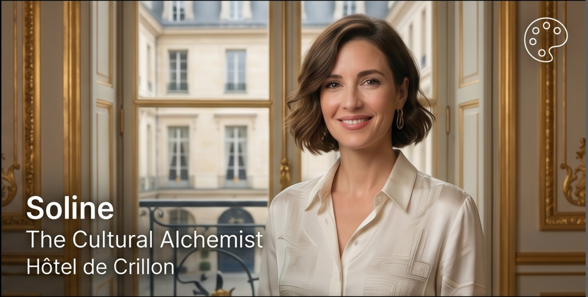

  

# Aura — Personal Concierge

An omnichannel AI concierge for Rosewood Hotels. Guests interact via email, SMS, or phone — and the system behaves as a single, omniscient entity with full context across every channel.

Built for the [Cerebral Valley Rosewood Hospitality 2030 Hackathon](https://cerebralvalley.ai/e/rosewood-hospitality-2030/details).

---

## System Architecture

  

---

## Agent Personas

Each Rosewood property has a dedicated concierge persona, matched to its guest culture.

<table>
  <tr>
    <td align="center" width="33%">
       
      <strong>Aris</strong> 
      <em>The Frictionless Strategist</em> 
      Rosewood Sand Hill · Silicon Valley  
      Direct, crisp, computationally elegant. Optimizes for time and cognitive bandwidth. Strips hospitality fluff in favor of flawless execution.
    </td>
    <td align="center" width="33%">
       
      <strong>Thatcher</strong> 
      <em>The Discretionary Insider</em> 
      The Carlyle · New York City  
      Stately, literary, unshakeably calm. Multi-generational family advisor energy. Absolute discretion for high-profile guests.
    </td>
    <td align="center" width="33%">
       
      <strong>Soline</strong> 
      <em>The Cultural Alchemist</em> 
      Hôtel de Crillon · Paris  
      Poetic, sensory-driven, effortlessly sophisticated. Treats hospitality as an elite form of sensory art. Weaves in <em>art de vivre</em> naturally.
    </td>
  </tr>
</table>

---

## Skills

Standalone capabilities agents invoke to serve guests. Each has a `SKILL.md` spec, a runnable CLI script, and a Python function registered as a tool in `server/tools.py`. All scripts fall back to mock data when API keys are absent.

| Skill | When to use | Run it |
|---|---|---|
| `guest-research` | New guest contact, room prep personalization | `uv run skills/guest-research/scripts/research.py --name "…" --email "…"` |
| `book-car` | Guest needs ground transportation | `uv run skills/book-car/scripts/book.py --guest-name "…" --pickup "…" --destination "…" --pickup-time "…"` |
| `send-calendar-invite` | Reservation confirmed; guest wants it on calendar | `uv run skills/send-calendar-invite/scripts/send_invite.py --email "…" --summary "…" --start "…" --end "…"` |

---

## Demo Flow

1. **Email** — Flight confirmation arrives → agent extracts arrival time → calls `update_pms_room_prep` to pre-cool the room and queue a welcome amenity.
2. **SMS** — Guest texts to reschedule a massage → agent checks availability → updates booking → replies via Twilio.
3. **Phone** — Guest calls for room service → ElevenLabs voice agent responds with full prior context: *"Of course, Mr. Ma — your double espresso will be at your door in 5 minutes."*
